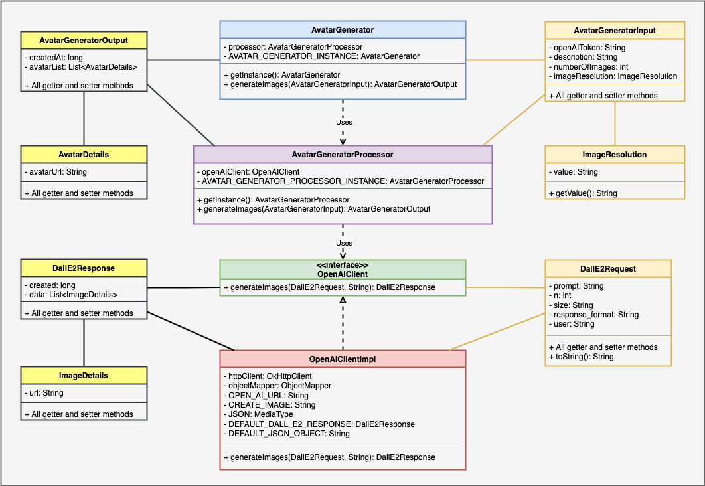

# avatar-java

avatar-java is java client library `(V1.0.0 version)` that you can easily integrate with your java service.

```java
AvatarGenerator avatarGenerator = AvatarGenerator.getInstance();

AvatarGeneratorInput input = AvatarGeneratorInput.builder()
        .openAIToken("open-ai-token")
        .description("unicorn running on mars")
        .imageResolution(ImageResolution.H_256_W_256)
        .build();

AvatarGeneratorOutput output = avatarGenerator.generateImages(input);
```
## How to use it?
1. Add the following dependency in your pom file
    ```xml
    <groupId>ai.generator.avatar</groupId>
    <artifactId>avatar-generator</artifactId>
    <version>1.0.0</version>
    ```
2. Create `AvatarGenerator` object, using this line: `AvatarGenerator avatarGenerator = AvatarGenerator.getInstance();`
3. Prepare its input object `AvatarGeneratorInput`, refer to following line:
    ```java
   AvatarGeneratorInput input = AvatarGeneratorInput.builder()
        .openAIToken("open-ai-token")
        .description("unicorn running on mars")
        .imageResolution(ImageResolution.H_256_W_256)
        .build();
    ```
4. Pass the input into input `avatarGenerator.generateImages(input)` function. It will generate and send the list of pictures. 

# Class-Level Diagram
Here is the class-level diagram of V1 version. The `AvatarGenerator.generateImages` is the entry point of the client library.



